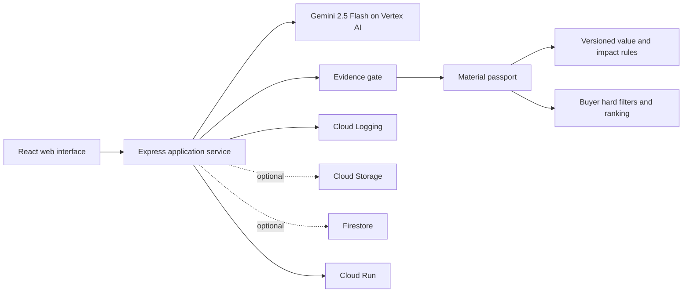

# MaterialLoop AI Architecture

## Decision boundary

Gemini interprets unstructured evidence. Deterministic code controls financial calculations, environmental arithmetic, evidence gates and final match scores.

## Responsibilities

| Component | Responsibility | Trust boundary |
| --- | --- | --- |
| React interface | Evidence upload, scenario selection and result review | Never receives Google credentials |
| Express service | Request validation and workflow orchestration | Server side only |
| Gemini provider | Photo and certificate interpretation, candidate pathways | Produces observations, not final claims |
| Evidence gate | Missing-field and conflict checks | Blocks downstream claims when evidence fails |
| Value and impact engine | Versioned deterministic calculations | Uses synthetic demo datasets |
| Matcher | Hard-condition filtering followed by ranking | Cannot re-admit an ineligible buyer |
| Cloud Logging | Structured run events | Excludes credentials and source documents |

## Google Cloud deployment

- Vertex AI runs Gemini 2.5 Flash with structured JSON output.
- Cloud Build creates the container image.
- Artifact Registry stores versioned images.
- Cloud Run serves the public web interface and API.
- Cloud Logging records analysis start, completion and failure events.
- A dedicated runtime service account receives Vertex AI User permission.
- Cloud Storage and Firestore are optional adapters. The public competition deployment leaves persistence disabled until the team approves the permanent data region.

## Reliability controls

- Zod validates model output and public result contracts.
- The Gemini provider repairs only presentation-level JSON issues and retries once.
- Evidence failures return explicit states instead of guessed values.
- Case B and Case C regression tests ensure value, impact, matching and notification claims remain blocked.
- Every successful analysis has a run ID and a structured Cloud Logging event.
